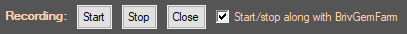

# AreaTiming
## Description:
This addon monitors area transitions/completion time and displays a variety of stats related to speed.
___
## Features:
- #### Recording of area to next area timings
- #### Mod50 filters (e.g. z1 to z6 is the same as z51 to z56)
- #### Stacks gained during online/offline stacking
___
## Overview:
###

####
Press start to start recording a new session, stop to stop recording the current session.  
Press close to close the timer script. **Doing so will prevent from viewing previous data at all.**  
* **Start/stop along with BrivGemFarm**
>Enabling this will overload the start/stop buttons in the BrivGemFarm tab, so they can start or stop the timer script.
___

####
You can select any current or previously recorded session or run using the dropdowns.  
Enter the ID of the session/run to view or scroll up/down using the mouse wheel while hovering the controls.
- **Current session:** jumps to the current session being recorded
- **All runs:** show stats from all runs in the current session
- **Current run:** jumps to the current run being recorded
___
  
**All areas:** Display all individual zone to zone items  
**Mod50:** Display mod50 values  
**Stacks:** Display stacking events
####
* **Show uncapped game speed**
>This option allows to display uncapped game speed.
Game speed caps out at x10.
####
Game speed reading enables monitoring certain events that modify game speed:
- Shandie's Dash ability
- Hew Maan's "The Path is Clear" feat
- Potion "bleed"
- Getting hit by ranged enemies (notably pixies in Tall Tales)
####
Showing the uncapped value allows to see changes to game speed modifiers while above x10 speed.
####
* **While in mod50 mode:**  

>This option filters out z1, stacking zones and reset from mod50 zone calculations.
___
### Data
- **Area:** Start area
- **Next:** Next area  
Every recording is made of an area-to-next pair. Stack recording can be either the same area or different areas in special cases.
- **T_area:** Time to complete the area.
- **T_tran:** Transition time between area and next area (black screen).
- **T_Time:** Total area to next time (T_area + T_tran).
- **T_run:** Cumulative run time from z1.
- **Count:** Total number of identical zone to zone items in the current session
- **HStacks:** Current number of Briv Sprint (Haste) stacks.
- **SBSTacks:** Current number of Briv Steelbones stacks.
(if viewing a single run with the mod50 filter, **Count_run** also shows the total number of identical items in the current run).
- **Game speed:** Game speed at the time when the area was completed.  
### Stacks data
- **Stacks:** Number of stacks gained during a single stacking event.
Multiple stack event will be shown if they exist.  
All items can be viewed at the same time if viewing all runs (**run ID** will be displayed).
- **Stacks/s** Rate of stacks per second gained during stacking.
- **Jumps/s** Equivalent value of Briv jumps (with Metalborn) gained per second during stacking.
>For maxing BPH, jumps/s should be as high as possible after making sure that enough stacks to reach the reset area are gained in a single stacking event.
___
## Additional info
>Due to implementation, loading sessions/runs while the script is recording will be slower than during offline stacking or while no active session is being recorded.
