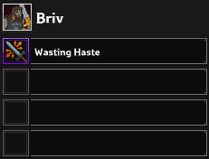

# Briv Feat Swap

## Description:
This Addon will allow to use Briv in E formation so you can take advantage of the "save feats with formation" feature in order to have a faster gem farm (more quick transitions).  
You will have to get Briv to 5J+ to be able to use this feature.

### Setup:
1. Enable/Disable the Addon in **Addon Management** (Jigsaw puzzle piece in IC Script Hub) to turn it on/off. It should start/stop whenever you click on the main Briv Gem Farm tab.
2. Set up your jumps in **Advanced Settings** tab (IC Script Hub) and save in **Briv Gem Farm** tab.
3. Set up your Briv feats in **Specialization and Feat Choices** (save formation menu in the game). Hit save for each formation. It is not recommended to save feats for other champions.
4. Start **Briv Gem Farm** in IC Script Hub.

## Recommended settings:
### Specialization and Feat Choices
#### (Q:nJ, E:4J, W:nJ if you are stacking on a checked zone, 4J otherwise)

Use the Wasting haste feat if you want to 4J with a specific formation, and another feat if you want to nJ (n > 4)).

Stacking with nJ: Q/W/E

    

Stacking with 4J: Q/W/E

    

### Advanced Settings Tab:
**(8J/4J)**

  

**(9J/4J)**

