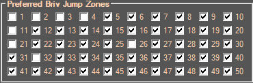

# Briv Feat Swap

## Description:
This Addon will allow to use Briv in E formation so you can take advantage of the "save feats with formation" feature in order to have a faster gem farm (more quick transitions).  
Indeed, Briv's **Wasting Haste** feat (12500 gems) allows him to cap his **Unnatural haste** ability (level.80) to 800% (4J). Using both Q and E formations you can use Briv's current jump and 4J during the same adventure.  
This means you will have to get Briv to **5J+** to be able to use this feature.

### Setup:
1. Enable/Disable the Addon in **Addon Management** (Jigsaw puzzle piece in IC Script Hub) to turn it on/off. It should start/stop whenever you click on the main Briv Gem Farm tab.
2. Set up your jumps in **Advanced Settings** tab (IC Script Hub) and save in **Briv Gem Farm** tab.
3. Set up your Briv feats in **Specialization and Feat Choices** (save formation menu in the game). Hit save for each formation. It is not recommended to save feats for other champions.
4. Start **Briv Gem Farm** in IC Script Hub.
5. To prevent input spam, open this addon's tab, enter the number of skips Briv should do in Q/E in the text fields then save.

## Recommended settings:
### Specialization and Feat Choices
#### (Q:nJ, E:4J, W:nJ if you are stacking on a checked zone, 4J otherwise)

Use the Wasting haste feat if you want to 4J with a specific formation, and another feat if you want to nJ (n > 4)).

Stacking with nJ: Q/W/E

    

Stacking with 4J: Q/W/E

    

### Advanced Settings Tab:

|                  **5J/4J TT (Untested)**                   |
|:----------------------------------------------------------:|
| **Path:** 1, 6, *11*, 16, 21, 26, 31, 37, 43, 49, 55, *61* |
|         **+** 9 jumps /50 vs 10 jumps /50 for 4JTT         |
|           **+**     7/9 QTs vs 6/10 QTs for 4JTT           |
|    **-** Can't cancel Briv's jump during z37->z43->z49     |
|                               |   

|             **8J/4J TT (requires perfect 8J)**              | **8J/4J TT (walk the first 4 areas using LevelUp addon)** |
|:-----------------------------------------------------------:|:---------------------------------------------------------:|
|   **Path:** 1, 10, 19, 28, *37*, 46, 55, 64, 73, 82, *87*   |    **Path:** 1, 2, 3, 4, *5*, 14, 23, 32, 37, 46, *55*    |
|         **-** 6 jumps /50 vs 11 jumps /100 for 8JTT         |                             /                             |
|        **+** 6/6 QTs after z37 vs 6/11 QTs for 8JTT         |                             /                             |
| **-** Can't cancel Briv's jump during z1->z10->z19-z28->z37 |                   + 100% QT, avoids z10                   |
|                                |                     |

|               **9J/4J TT**                |
|:-----------------------------------------:|
|  **Path:** *1*, 11, 21, 31, 36, 46, *51*  |
| **-** 6 jumps /50 vs 5 jumps /50 for 9JTT |
|     **+** 6/6 QTs vs 3/5 QTs for 9JTT     |
|              |   
