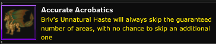
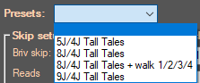
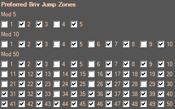
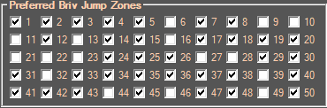
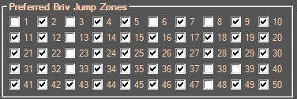
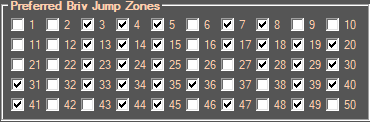
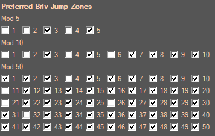
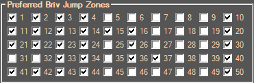
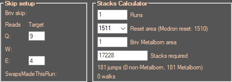

# Briv Feat Swap

## Table
[Description](#description)  
[Setup](#setup)  
[Routes](#using-thellora)

___

## Description
This Addon will allow to use Briv in E formation, so you can take advantage of the "save feats with formation" feature
in order to have a faster gem farm because you can hit more quick transitions (QT) during the run. If there is a quick transition  
between two areas, the champions stay in place instead of walking to the right of the screen after the area has been completed.

Briv's **Wasting Haste** feat (12500 gems) allows him to cap his **Unnatural haste** ability (level.80) at 800% (4J).

Briv's **Strategic Stride** feat (10000 corrupted gems) allows him to cap his **Unnatural haste** ability (level.80) at 25600% (9J).

Briv's **Wasting Haste** feat (100000 Ruby Coins @ 1e12 Mirt influence) allows him to cap his **Unnatural haste** ability (level.80) at the
previous perfect jump amount. For example, 10J1% (100% to 9J and 1% to 10J) gets rounded down to 9J with the feat.

Using both Q and E formations you can alternate between jumping with Briv's current jump and either 4J, 9J or perfect jump.

>The 4J feat doesn't do anything if Briv is under 4J.  
>The 9J feat doesn't do anything if Briv is under 9J.  
>The Accurate Accobatics only works when Briv is not at perfect jump. **This means you need to stop at the perfect ilvl requirement minus one**.
> E.g. to do 12J/11J, Briv's slot 4 needs to be at ilvl 1023625 GE, 1364917 SE or 2047500 dull.

___

## Setup

1. Enable/Disable the Addon in **Addon Management** (Jigsaw puzzle piece in IC Script Hub) to turn it on/off. It should start/stop whenever you click on the main Briv Gem Farm tab.
2. Set up your **Preferred Briv Jump Zones** in this addon's tab or in **Advanced Settings** tab (IC Script Hub) then save.
You will have to manually save your profile in **Briv Gem Farm** tab.
3. If you have the LevelUp addon, you can set the BrivMinLevelArea setting to walk the first few zones.

For steps 2 to 3, you can also use one of the **presets** to autofill advanced settings.

 

4. Set up your Briv feats in **Specialization and Feat Choices** (save formation menu in the game).
Hit save for each formation. It is not recommended to save feats for other champions.

5. Start **Briv Gem Farm** in IC Script Hub.

To stop this addon from working (e.g. to farm chests in events), uncheck **Enabled** next to **Save** then **Save**.

 

>**Disclaimer**: You may want to stop the gem farm (BrivGemFarm_Run.ahk) before turning this addon off.

___

## Recommended settings
### Specialization and Feat Choices
#### (Q:nJ, E:4J)

Use the Wasting haste feat if you want to 4J with a specific formation, and another feat if you want to nJ (n > 4).

   

You can fill the slots in W with feats such as HP or overwhelm to boost offline stacking.

### Routes

#### Maps 

* **TT:** Tall Tales (Witchlight) 
* **RAC:** Resolve Amongst Chaos (Descent into Avernus)  
  (6J/4J route, if you somehow have far more Tiamat's favor than Corellon's.)

#### Mouse click option - Don't use it with Diana or Shandie

Routes with 100%QT won't have Briv's jump animation during transitions.  
For the routes that aren't 100%QT, you can use the option below to have the script click on the "Clear formation" button to cancel Briv's jump animation.  
**This is extremely disruptive and will steal mouse focus every few seconds.**  
**This should not be used with Diana or Shandie or her abilites will never work.**

   

Clearing formation will remove all champions but leave familiars on the field.
This means:
* Shandie will always be off during the run.
* BBEG and Sentry quest reduction effects will be disabled for the next area after each cancel.  
Maxed Virgil + 2 Rivals of Waterdeep and using Vajra for patron can stil complete the area with a single kill.

#### Preferred Briv jump zones

🖱️ Mouse click improves speed  
🖱️🖱️ Mouse click is necessary to beat the best route that doesn't use feat swap  
🔁 Repeating sequence of base zones (1-50)

#### Using Thellora:

With enough stacks, Thellora can skip right to the faster repeating sequence.  
For each route, you should aim to land on an area that matches one of the 🔁 base zones.  
The number equal to your (favor - 1) should have the last two digits equal to one of the 🔁 numbers.
If this is not possible, you can walk to it by setting the "Minimum area to reach before leveling Briv" setting
to the level that matches the next 🔁 zone you will encounter (or 5 zones before and 4-jumping into the path).
> The path to the 🔁 zone must be clear of armored bosses you can't beat. (TT: z30/z35, RAC: z5/z40)

| **5J/4J TT**                                                   |
|:---------------------------------------------------------------|
| **Path:** 1, 6, **11**, 16, 21, 26, 31, 37, 43, 49, 55, **61** |
| 🔁 5, 11, 16, 21, 26, 31, 37, 43, 49                           |
| **+** 9 jumps /50 vs 10 jumps /50 for 4J TT                    |
| **+**     7/9 QTs vs 6/10 QTs for 4J TT                        |
| **-** Can't cancel Briv's jump (z37->z43->z49) 🖱️             |
|                                   |   

| **6J/4J TT**                                                                            | **6J/4J RAC**                                       |
|:----------------------------------------------------------------------------------------|:----------------------------------------------------|
| **Path:** 1, 8, 15, 22, 27, 32, 37, 44, 49, **54**, 61, 66, 71, 76, 83, 90, 97, **104** | **Path:** **1**, 6, 11, 18, 25, 32, 39, 44, **51**  |
| 🔁 4, 11, 16, 21, 26, 33, 40, 47                                                        | 🔁 1, 6, 11, 18, 25, 32, 39, 44                     |
| **-** 8 jumps /50 vs (7 jumps + 1 walk) /50 for 6J LL/TT                                | =                                                   |
| **+** 5/8 QTs vs 4/8 QTs for 6J LL/TT                                                   | **+** First loop is faster than TT                  |
| **-** Can't cancel Briv's jump (z33->z40->z47) 🖱️🖱️                                   | **-** Can't cancel Briv's jump (z1->z6->z11) 🖱️🖱️ |
|                                                                                         | **-** No blessing to reduce area objectives         |
|                                                            |                       |

| **7J/4J TT**                                                       |
|:-------------------------------------------------------------------|
| **Path:** 1, 9, 14, 22, 23, **31**, 39, 47, 55, 63, 71, 76, **81** |
| 🔁 5, 13, 21, 26, 31, 39, 47                                       |
| **+-** 7 jumps /50 vs (6 jumps + 2 walks) /50 for 7J TT            |
| **+** 5/7 QTs vs 6/8 QTs for 7J TT                                 |
| **-** Can't cancel Briv's jump (z31->z39->z47) 🖱️🖱️              |
|                                       |

| **8J/4J TT (requires perfect 8J)**                                      | **8J/4J TT (walk z1 to z5 using LevelUp addon)**        |
|:------------------------------------------------------------------------|:--------------------------------------------------------|
| **Path:** 1, 10, 19, 28, **37**, 46, 55, 64, 73, 82, **87**             | **Path:** 1, 2, 3, 4, **5**, 14, 23, 32, 37, 46, **55** |
| 🔁 5, 14, 23, 32, 37, 46                                                | 🔁 5, 14, 23, 32, 37, 46                                |
| **-** 6 jumps /50 vs 11 jumps /100 for 8J TT                            | =                                                       |
| **+** 6/6 QTs after z37 vs 6/11 QTs for 8J TT                           | =                                                       |
| **-** Can't cancel Briv's jump  (first loop z1->z10->z19->z28->z37) | **+** 100% QT, avoids z10                               |
|                                            | =                                                       |

>For 8J/4J, the second option can be used as an alternative when not using Thellora.

| **9J/4J TT** (if not using Diana)           |
|:--------------------------------------------|
| **Path:** **1**, 11, 21, 31, 36, 46, **51** |
| 🔁 1, 11, 21, 31, 36, 46                    |
| **-** 6 jumps /50 vs 5 jumps /50 for 9J TT  |
| **+** 6/6 QTs vs 3/5 QTs for 9J TT          |
|                |

>🔁 2, 12, 22, 27, 37, 47 is still 100%QT without collect zones if landing on this path with Thellora.       

## Stacks:

For all the routes except for 5J/4J, more Briv Steelbones/Sprint stacks are needed to reach the reset area
than if not using Feat Swap.
To know how exactly how many stacks are required, you can use the calculator built into the addon.

- **Runs:** How many runs with a single stacking setup.
- **Reset area:** Last area reached in the run (area you land past the Modron reset setting).
- **Briv Metalborn area** Briv uses 4% of his current Sprint stacks for every jump, or 3.2% if he is level170 and over.

 

>Don't forget to adjust the "Minimum area to reach before leveling Briv" setting, especially when using Thellora.