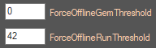
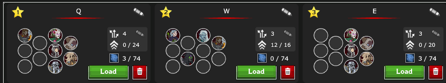
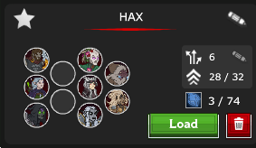
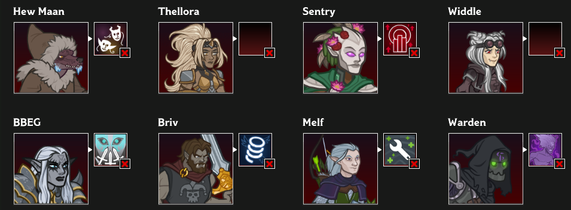
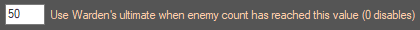
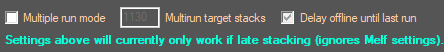
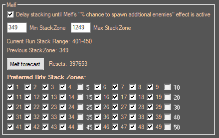
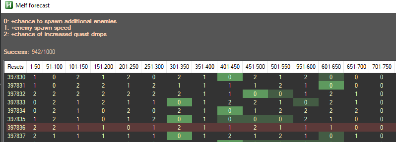
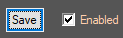

# Hybrid Turbo Stacking

___

## Description:

Hybrid stacking is a Briv Gem Farm Briv stacking method that was made popular by **Hamerstein**.  
It stacks Briv online for a set number of resets or until a number a gems has been reached, using Tatyana to pull enemies,
then goes offline to by chests and prevent game memory leak buildup.

This Addon uses several other techniques to improve the overall stacking speed and setup.

___

## Champions:

>**Level 20 - Steelbones**  
Briv stores power whenever he takes damage and uses it to buff the party and Sprint forward.
Whenever Briv comes under attack metal shoots out of his pores and covers him in strong armor.
While armored, Briv takes 10% less damage and gains stacks of Steelbones whenever he is hit by an enemy attack.

**Briv** is used to gather steelbones stacks for himself, that are converted to Sprint
stacks after reset and consumed every time he jumps forward.

>**Level 70 - Melf's Speedy Supplement (+100% boost at level 100 - Bonus Adaption)**  
Melf provides a random speed-up buff. The buff provided changes after every 50th area and draws from these three possibilities:
>- (x)% chance to spawn additional enemies.
>- Increased enemy spawn speed by (x)%.
>- (x)% chance of increased quest drops.

The first effect is by far the most desireable one for online stacking.  
The effects are chosen depending on the current lifetime number of resets, which is used by this addon
by enabling multiple stack zones instead of one and wait until **Melf**'s first effect is active.

>**Level 80 - Find a Feast**  
If Tatyana is not attacked for 15 seconds, and the players are in a non-boss area with no barriers,
she briefly runs ahead off the right side of the screen. She returns 2 seconds later from the right side with (x) additional enemies that simultaneously spawn.
After she returns, the 15 seconds counter starts again from 0 seconds.

**Tatyana** is a slower alternative to Melf, but is guaranteed to work every time as long as she stays behind Briv.

>**Level 250 - Hunger of Hadar**  
Warden opens a rift to the void, damaging and momentarily stunning all enemies
and pulling them and all active specters to a position slightly in front of the formation.

**Warden**'s ultimate is used to pull enemies in range of Briv faster than if they were walking up to him.

___

## Setup:

1. Enable hybrid stacking in ICScripthUb by setting a value higher than 0
to ForceOfflineGemThreshold and/or a value higher than 1 to ForceOfflineRunThreshold.  

2. Setup and save the W formation in-game.

3. Setup and save specializations in Modron in-game, so that they don't pop up during leveling.  
The trick is to use a specific formation with all the champions used and make sure
this is the formation loaded in the Modron.  

4. Setup settings in this addon's tab, enable and save.

5. Start Briv Gem farm.

___

## Settings:

Beats the zone the script want to stack on before switching to W.  
This is faster than having to fall back one zone then going forward one zone to complete the level after stacking,
especially if the transition between the two isn't a quick transition (**QT**).

___

Activates Warden's ultimate when the number of enemies on the screen has reached this value.  
Very useful with Tatyana, less with Melf since unlike with Tatyana, enemies spawning is staggered.
Setting the value to 0 disables the feature.

>**⚠️ Be careful**: A high enough BUD combined with enough item levels on Warden's slot 6 can cause the ultimate
to kill enemies in lower zones.

___

Enabling this will allow stacking every two or more runs.
Make sure that "Multirun target stacks" is set high enough for at least two full runs.  

Enabling "Delaying offline" will make the script do additional runs until the stacks
have fallen under the target for a single run before going offline (will use the setting in BrivGemFarm tab).

> ⚠️ Currently won't work unless stacking happens one or two zones before reset.
For now, Melf settings will be ignored while the option is active.

___

Enabling this allows to stack on a zone where Melf's first speed effect will be active. 

You can set min/max zones to define the range where you can stack without killing enemies
or Briv being killed before gaining enough stacks. For offline, the BrivGemFarm setting is used.  

Tatyana/Melf won't work optimally or even work at all in boss zones or in zones with barriers.
Stacking in a boss zone is disabled by default, and you can manually disable other zones.

Click on "Melf forecast" to open a window showing which Melf effects you will get for the next 1000 resets.
The first +enemy spawn effect is highlighted in green for each reset count, then the rermaining others,
if they happen to be in the range specified in settings.
The whole row will be highlighted in red if the first speed effect is not available within the range for that reset.

If stacking with Melf isn't possible within the range, stacking will happen in the first
zone after the BrivGemFarm setting (use Tatyana if the range is not large enough for 100% success rate).

___

Toggle on/off, then save to quickly enable or disable this addon.