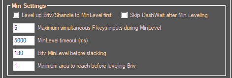
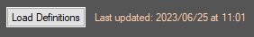

# BrivGemFarm_LevelUp
## Description:
This Addon will allow to set up maximum champion level settings for the Briv Gem Farm addon.
####
It performs the best using **x100** upgrade settings, although in some cases **x25** is preferred to prevent a champion from getting upgrades that would end up being detrimental to performance.  
####
If you have set upgrade settings to next upgrade mode, Briv may not achieve level 170 in time.  
It is recommended to set his min level to 80 instead at the expense of a small increase in stacks consumption during the first few jumps,
or to check **Level up Briv/Shandie to MinLevel first** under the **General Settings** section.
___
## Briv stacking:
####
During offline stacking, Briv gets more stacks as he is able to survive longer.
Sometimes it is undesirable to get many stacks because the simulation takes longer to complete.
Select a maximum level in the **Briv MinLevel before stacking** dropdown list under **General Settings**, so he won't receive as many health upgrades.
####
If you're setting Briv's min level to less than level 110 so that he gets Unnatural Haste but not Healing Phlo,  
set up **Briv MinLevel before stacking** under **General Settings** to a value under 110.  
Select 170 or more in MaxLevel so that after stacking, Briv will be leveled back to level 170 and gain his MetalBorn upgrade to reduce the amount of stacks lost after every jump.
___
## Settings:
###
#### BrivGemFarm LevelUp Settings:

####
Select Q/W/E to show saved game formations.
* **Show spoilers** (default: unchecked)   
Show unreleased champions in their respective seat (upgrades/levels may or may not be accurate before release date).
####
**For each champion:**  
* Min level is the minimum level for a champion after a reset before waiting for Shandie dash.  
* Max level is the maximum level for a champion when minimum leveling is complete or after 5s on z1.
___
#### Default Settings:

####
* **Default min level** (default: 0)   
Default min level for champions with no default values.  
0 - Don't initially put the champion on the field |
1 - Put the champion on the field at level 1
####
* **Default max level** (default: 1)  
Default max level for champions with no default values.  
1 - Put the champion on the field and don't level them |
Last upgrade - Level up the champion until soft cap
___
#### General Settings:

####
* **Level up Briv/Shandie to MinLevel first** (default: unchecked)   
Level up Briv and Shandie before other champions after resetting.  
This is useful when using the in-game next upgrade/double arrow setting as leveling champions that multipy the amount of quest items received has a side effect of causing the area to be completed before Briv gets his jump ability at level 80.
####
* **Skip DashWait after Min Leveling** (default: unchecked)  
Skip waiting for Shandie's dash being active after leveling champions to MinLevel. Useful if stacking really early in the run.
####
* **Maximum simultaneous F keys inputs during MinLevel** (default: 4)  
Maximum number of champions being leveled up during the intial leveling to minLevel. This can help if input lag causes champions to be overleveled during the initial leveling.
####
* **MinLevel timeout (ms)** (default: 5000)  
Timeout before stopping the initial champion leveling. If set to 0, minimum leveling will be skipped.
####
* **Briv MinLevel before stacking** (default: 1300)  
Briv will be leveled up to this level before attempting to stack. After stacking is done, leveling will resume up to MaxLevel.
####
* **Minimum area to reach before leveling Briv** (default: 1)  
Minimum area before starting to level up Briv (used to walk at the beginning if using Briv in E formation with the Wasting Haste feat).
___
#### Fail Run Recovery Settings:

####
* **Level up champions to soft cap after failed conversion** (default: checked)   
Level up champions to soft cap after failed conversion if Briv has lower than 50 Sprint stacks.
####
* **Briv included** (default: unchecked)  
Level up Briv to soft cap after failed conversion if Briv has lower than 50 Sprint stacks.
___
#### Load definitions:

####
Definitions are updated automatically as needed on launch, but you can choose to update them manually.  
After clicking on **Load Definitions**, you can either select a new file or use the previous location.