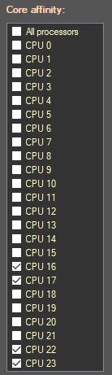

# Process Affinity

## Description:
This Addon will allow to restrict IC to be run only on a selection of cores, so you can use your fastest cores to run the game.  
Toggling any cores for the game will also prevent the script from using them.

### Setup:

Check the boxes corresponding to the cores you want IdleDragons.exe (Idle Champions's process) to use.  
The script will also restrict ICScriptHub and Briv Gem Farm process execution to the unchecked cores.  
You can quickly select/unselect all cores using the first checkbox.

### Example:

Using the settings below, the game will use only cores 16, 17, 22 and 23.  
The script is allowed to use the remaining cores (0, 1, 2, 3, 4, 5, 6, 7, 8, 9, 10, 11, 12, 13, 14, 15, 18, 19, 20, 21).

  

>**Note:** If no core is selected, settings can't be applied.
