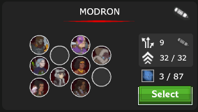

# RNG Waiting Room

___

## Description:

This addon allows to get optimal gem cards draws for Ellywick while gem farming.  
It will increase the Gems Per Hour (GPH) of your gem farm by allowing Ellywick to draw gem cards on z1 before Thellora
is placed on the field, getting more gems for all the bosses she skips in the process.

___

## How to use:
This addon requires ICScripthub v4.0 with EffectKeyHandler Memory v2.5.0 and the LevelUp addon.

### Ellywick

Set up her MinLevel in the LevelUp addon to level **200**, so that she gains her specialization **All That Sparkles**.

>**Level 200 - All That Sparkles**  
Additively increases the odds of Gem cards being drawn by 20% (additively reducing the odds of each other card by 5%)

This brings the percent chance of drawing Gem cards to **40**%.

### Thellora

Thellora needs to be removed from the Modron formation to stack Ellywick on z1.
If you switch to the Q/E formation while she is in either of them, she will be put on the field as any seat 1 hero.

If Thellora jumps before Ellywick has drawn gem cards, you will lose the gem bonus for every single boss skipped by Thellora
when the next save is sent to the server. This is critical if you hit a boss early in your run since going to a boss zone
triggers a save after you kill a boss for the first time and the bag of gems drops.  
Saving also triggers periodically after a set amount of seconds (15?).

You have to save another formation containing all the champions in the starting formation (minus Thellora) if you want the game to pick specialzations while levelling.  

Select your formation in the Modron Automation Setup menu.

### Dungeon Master

If Dungeon Master is saved in the Modron formation, his ultimate will be used automatically to refresh Ellywick's.

## Settings:

#### The settings below are used on z1 before Thellora is placed on the field.

* **Number of gem cards** (default: 1)   
The addon waits until Ellywick has drawn this number of cards before progressing.

* **Max redraws** (default: 1)  
Number of times to redraw cards using Ellywick's ultimate.  
>Even with no redraws left, her ult will be used on cooldown if she doesn't have any gem cards during the run.

* **Always wait for 5 draws** (default: True)  
Always waits for 5 cards to be drawn before progressing, even the target number of gem cards has been reached.
If your route hits bosses, you will want to activate this so the gem bonus is applied to bosses in the next save, 
since going to a boss zone triggers a save after you kill the boss and the bag of gems drops.

>If the desired number of gem cards can't be achieved with the remaining draws while waiting for a full hand,
> Ellywick's ultimate will be used early even if the **Always wait for 5 draws** setting is enabled.
> 
> Example: If Ellywick currently has **1** Gem card, **1** Moon card, and **Number of gem cards** is set to **5**, you'd need
> an additional 4 cards to have 5 gem cards, which is impossible since Ellywick can only have 5 cards in her hand at once.
> Her ultimate will be used early when there is at least 1 redraw left and her ultimate is off cooldown.

> ⚠️ This addon disables formation switching to prevent Thellora from being loaded on z1.  
> You will have to switch formations manually if Ellywick is not on the field before pressing the **Start Gem Farm** button
> (unless switching from the stack formation).